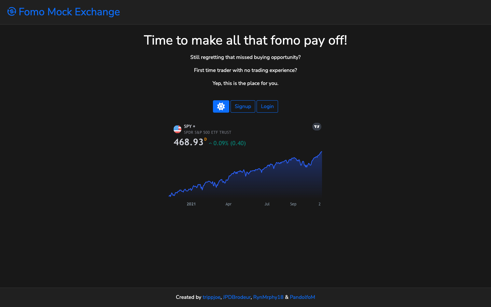

[](https://github.com/RynMrphy18/fomo-mock-exchange/blob/main/LICENSE)
[](https://github.com/RynMrphy18/fomo-mock-exchange/graphs/contributors)
[](https://agile-escarpment-74741.herokuapp.com/)
# Fomo Mock Exchange

Fomo Mock Exchange is a stock trading site for people who want to play with the current stock market and not have the risk of losing their personal earnings.

## Table of Contents

1. [Live Site](#liveSite)
2. [Preview](#sitePreview)
3. [Useage](#use)
4. [Technologies](#tech)
5. [Contribute](#contribute)
6. [License](#license)

## Live Site <a id="liveSite"></a>
[Fomo Mock Exchange](https://agile-escarpment-74741.herokuapp.com/)
## Preview <a id="sitePreview"></a>
[](https://agile-escarpment-74741.herokuapp.com/)
## Usage <a id="use"></a>

```bash
npm start
```

## Technologies <a id="tech"></a>

- JavaScript
- [Node.JS](https://nodejs.org/)
- [Express.JS](http://expressjs.com/)
- [MySQL](https://www.mysql.com/)
- [Yahoo Finance](https://finance.yahoo.com/)
- [Bootstrap](https://getbootstrap.com/)
- [Handlebars](https://handlebarsjs.com/)
- [Bcrypt](https://www.npmjs.com/package/bcrypt)
## Contribute <a id="contribute"></a>

If you would like to contribute to Fomo Mock Exchange please feel free to do so.

Current Contributors:<br/>
<a href="https://github.com/RynMrphy18/fomo-mock-exchange/graphs/contributors">
  
</a>

## License <a id="license"></a>

[MIT LICENSE](./LICENSE)
